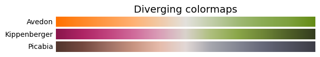
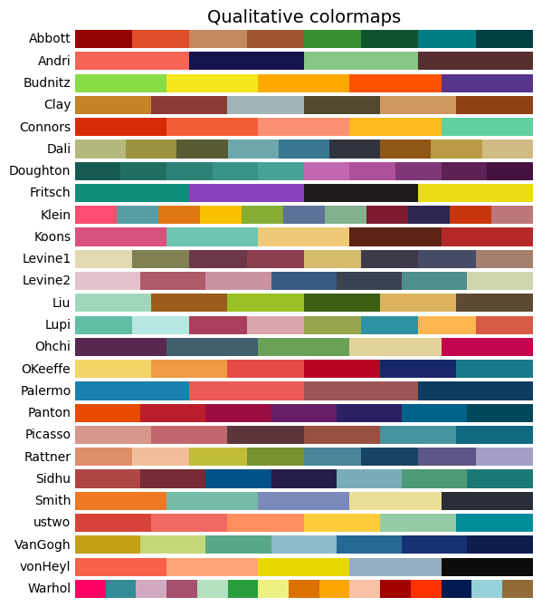

# pyMoMAColors

Python implementation of [BlakeRMills/MoMAColors](https://github.com/BlakeRMills/MoMAColors).

## Installation

To install the latest development build,

```bash
pip install git+https://github.com/alexlyttle/pyMoMAColors.git
```

## Usage

### Colormaps

```python
import momacolors as moma

moma.sequential.show_cmaps()
```


```python
moma.diverging.show_cmaps()
```



```python
moma.qualitative.show_cmaps()
```



### Example

```python
import numpy as np
import momacolors as moma

x = np.linspace(0, 2*np.pi, 101)
y = np.sin(x)
c = np.sin(x)**2

# Choose appropriate colormap
cmap = moma.sequential.Ernst

fig, ax = plt.subplots()
s = ax.scatter(x, y, c=c, cmap=cmap)
ax.set_xlabel("x")
ax.set_ylabel("y")
fig.colorbar(s, label=r"$\sin^2(x)$")
```


