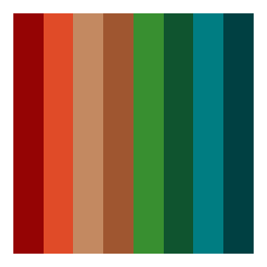
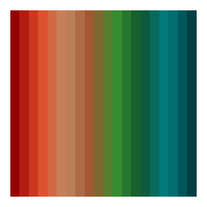
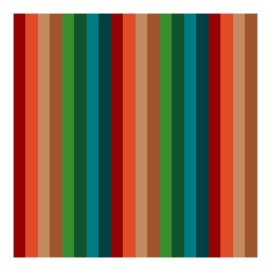
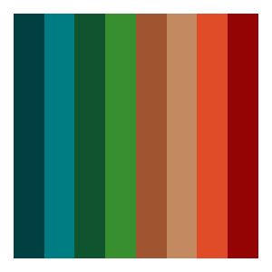
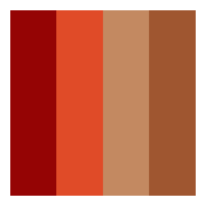
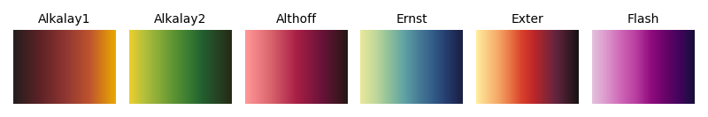
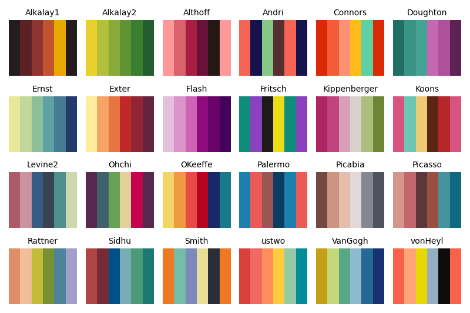

# pyMoMAColors

Python implementation of [BlakeRMills/MoMAColors](https://github.com/BlakeRMills/MoMAColors).

- [pyMoMAColors](#pymomacolors)
  - [Installation](#installation)
  - [Usage](#usage)
    - [Get colors](#get-colors)
    - [Get colormaps](#get-colormaps)
    - [Show colormaps](#show-colormaps)
    - [Example](#example)

## Installation

To install the latest development build,

```bash
pip install git+https://github.com/alexlyttle/pyMoMAColors.git
```

## Usage

```python
import momacolors as moma

moma.show_all()
```


### Get colors

You can use the following command to get a list of hexadecimal color codes drawn from a given color palette. E.g. for the Abbott palette,

```python
>>> moma.get_colors("Abbott")

['#950404',
 '#e04b28',
 '#c38961',
 '#9f5630',
 '#388f30',
 '#0f542f',
 '#007d82',
 '#004042']
```

The `get_colors` function has options to customize the colors output. To visualize these options, we can output a `matplotlib.ListedColormap` using the `get_colormap` function.

### Get colormaps

To get a colormap, e.g. Abbott

```python
moma.get_colormap("Abbott")
```



This returns a `matplotlib.colors.ListedColormap` object which you can use in plotting (see [Example](#example)).

You can customize the colormap using optional arguments. For example, return 20 colors,

```python
moma.get_colormap("Abbott", n=20)
```



See how the colors are interpolated. This is default behaviour when `n` is more than the number of colors in the palette. If you want to pick from only colors in the palette,

```python
moma.get_colormap("Abbott", n=20, brew_type="discrete")
```



See how the colors repeat.

You can reverse the colormap in the following ways,

```python
moma.get_colormap("Abbott", direction=-1)
moma.get_colormap("Abbott_r")
moma.get_colormap("Abbott").reversed()
```



These all return the same object,

```python
>>> moma.get_colormap("Abbott", direction=-1) == \
    moma.get_colormap("Abbott_r") == \
    moma.get_colormap("Abbott").reversed()

True
```

If you pick fewer colors than the number in the palette,

```python
moma.get_colormap("Abbott", n=4)
```


See how the colors are returned in a different order to the full palette. This is designed to maximize distiguishing between the colors. If you wish to override this,

```python
moma.get_colormap("Abbott", n=4, override_order=True)
```



### Show colormaps

Use the `moma.show_all` function to display the colors. This has options to aid in choosing a colormap to suit your scenario. To show only sequential colormaps (i.e. colormaps which are suited to sequential data),

```python
moma.show_all(sequential=True)
```


Brew sequential colormaps continuously by choosing `n` greater than the number of colors in the palette,

```python
moma.show_all(n=256, sequential=True)
```



Show diverging colormaps brewed continuously,

```python
moma.show_all(n=256, diverging=True)
```


Show 6 colors from all colorblind-friendly colormaps. If the palette has less than 6 colors, the colors are brewed continuously by default, otherwise they are picked in a predetermined order.

```python
moma.show_all(n=6, colorblind_friendly=True)
```


If you want all 6 colors to be picked from the discrete palette, set `brew_type="discrete`. Then, if the palette has less than 6 colors, the colors will repeat.

```python
moma.show_all(6, brew_type="discrete", colorblind_friendly=True)
```



If you want all colors to be interpolated, set `brew_type="continuous`.

```python
moma.show_all(6, brew_type="continuous", colorblind_friendly=True)
```


### Example

```python
import numpy as np
import matplotlib.pyplot as plt
import momacolors as moma

x = np.linspace(0, 2*np.pi, 101)
y = np.sin(x)
c = np.sin(x)**2

# Choose appropriate colormap
cmap = moma.get_colormap("Ernst", n=256)

fig, ax = plt.subplots()
s = ax.scatter(x, y, c=c, cmap=cmap)
ax.set_xlabel("x")
ax.set_ylabel("y")
fig.colorbar(s, label=r"$\sin^2(x)$")
```


