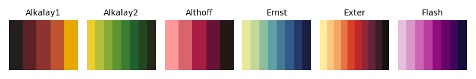
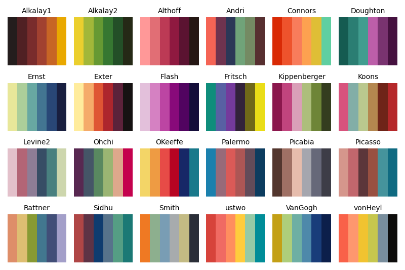

# pyMoMAColors

Python implementation of [BlakeRMills/MoMAColors](https://github.com/BlakeRMills/MoMAColors).

```python
import momacolors as moma

moma.show_all()
```


## Table of contents

- [Installation](#installation)
- [Usage](#usage)
    - [Get colormaps](#get-colormaps)
    - [Show colormaps](#show-colormaps)
    - [Example](#example)

## Installation

To install the latest development build,

```bash
pip install git+https://github.com/alexlyttle/pyMoMAColors.git
```

## Usage

### Get colormaps

To get a colormap, e.g. Abbott

```python
import momacolors as moma

moma.get_colormap("Abbott")
```


This returns a `matplotlib.colors.Colormap` object which you can use in plotting (see [Example](#example)).

You can customize the colormap using optional arguments. For example, return 20 colors,

```python
moma.get_colormap("Abbott", n=20)
```


See how the colors repeat. You can get 20 colors by interpolation instead,

```python
moma.get_colormap("Abbott", n=20, interpolate=True)
```


You can reverse the colormap in the following ways

```python
moma.get_colormap("Abbott", reversed=True)
moma.get_colormap("Abbott_r")
moma.get_colormap("Abbott").reversed()
```


These all return the same object,

```python
>>> moma.get_colormap("Abbott", reversed=True) == \
    moma.get_colormap("Abbott_r") == \
    moma.get_colormap("Abbott").reversed()

True
```

If you interpolate without specifying `n`, then `n = 256`. This is useful for *sequential* or *diverging* colormaps. For example,

```python
moma.get_colormap("Ernst", interpolate=True)
```


### Show colormaps

Show only sequential colormaps,

```python
import momacolors as moma

moma.show_all(sequential=True)
```



Show sequential colormaps and interpolate,

```python
moma.show_all(interpolate=True, sequential=True)
```


Show diverging colormaps,

```python
moma.show_all(interpolate=True, diverging=True)
```


Show 6 colors from all colorblind-friendly colormaps (for maps with less than 6 colors, the colors repeat),

```python
moma.show_all(n=6, colorblind_friendly=True)
```



Show 6 colors from all colorblind-friendly colormaps where the colors are determined by interpolating the original colormap,

```python
moma.show_all(n=6, interpolate=True, colorblind_friendly=True)
```


### Example

```python
import numpy as np
import matplotlib.pyplot as plt
import momacolors as moma

x = np.linspace(0, 2*np.pi, 101)
y = np.sin(x)
c = np.sin(x)**2

# Choose appropriate colormap
cmap = moma.get_colormap("Ernst", interpolate=True)

fig, ax = plt.subplots()
s = ax.scatter(x, y, c=c, cmap=cmap)
ax.set_xlabel("x")
ax.set_ylabel("y")
fig.colorbar(s, label=r"$\sin^2(x)$")
```


